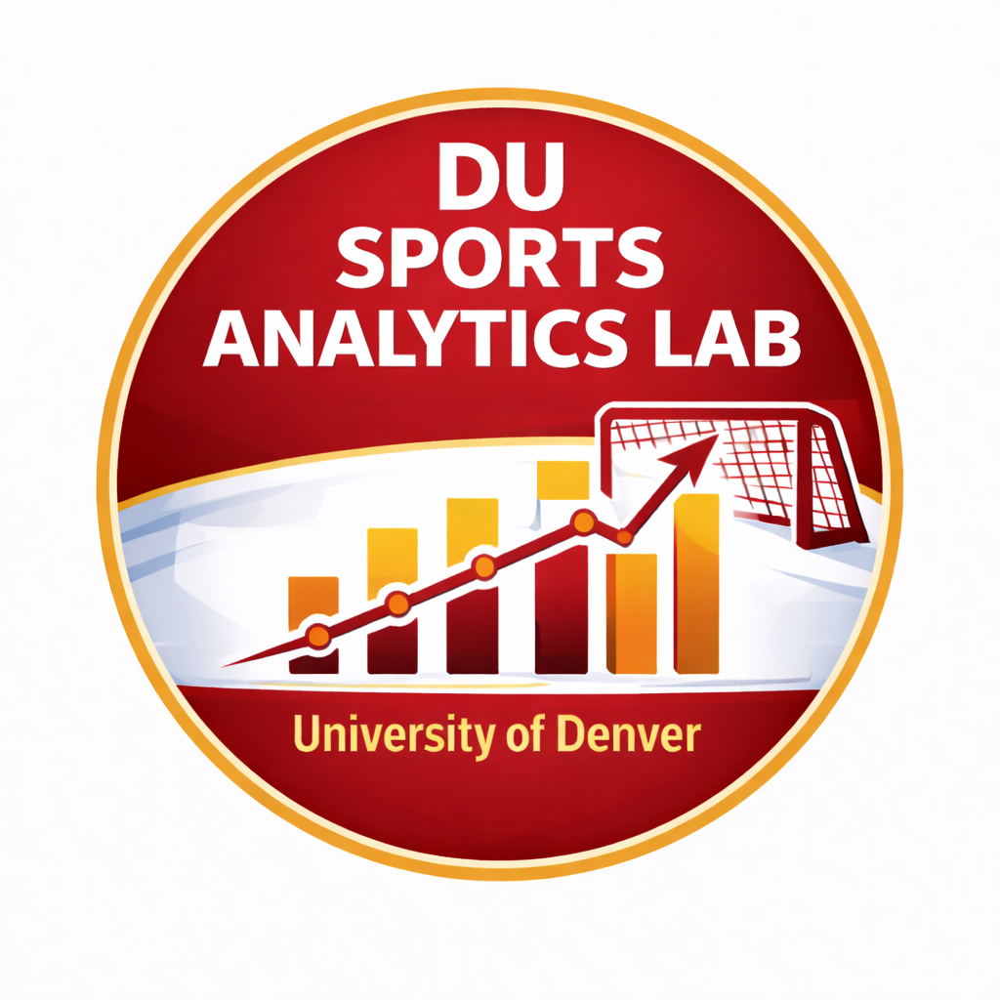

  

# 🏆 DU Sports Analytics Lab (DUSAL)

**University of Denver · Daniels College of Business**  
[🌐 Lab Website](https://daniels.du.edu/sports-analytics-lab/) · [📧 Get Involved](https://daniels.du.edu/sports-analytics-lab/#contact)

---

The DU Sports Analytics Lab brings together faculty and students from across the 
University of Denver to explore how data and analytics can improve decision-making 
in sports. Founded in 2024, the lab is a home for rigorous, high-impact sports 
analytics research — while giving students hands-on experience tackling real-world 
problems in professional, collegiate, and amateur sports.

---

## 🔬 Research Areas

- Player performance evaluation and new statistical metrics
- Talent identification and recruiting analytics
- Bias and equity in sports data, scouting, and evaluation
- Injury prevention and player health using tracking data
- Comparative analysis across men's and women's sports

---

## 📦 Repositories

| Repo | Description |
|------|-------------|
| [nba-points-above](https://github.com/DUSportsAnalyticsLab/nba-points-above) | NBA Points Above Average|

---

## 👩‍🏫 Faculty

**Co-Directors**
- [Ryan Elmore, PhD](https://daniels.du.edu/directory/ryan-elmore/) — Associate Professor, Business Information & Analytics
- [Benjamin Williams, PhD](https://daniels.du.edu/directory/benjamin-williams/) — Assistant Professor, Business Information & Analytics

**Participating Faculty**
- [Stefani Langehennig, PhD](https://daniels.du.edu/directory/stefani-langehennig/) — Assistant Professor of the Practice, BIA
- [Andrew Urbaczewski, PhD](https://daniels.du.edu/directory/andrew-urbaczewski/) — Professor, BIA
- Matt Rutherford — Computer Science, Ritchie School of Engineering

---

## 🎓 Get Involved

The lab welcomes undergraduate and graduate students, faculty collaborators, and 
industry partners. If you're interested in sports, data, and analytics — there's a 
place for you here.

👉 [Contact us via the lab website](https://daniels.du.edu/sports-analytics-lab/)

---

*Jointly supported by the [Department of Business Information & Analytics](https://daniels.du.edu/business-information-analytics/) 
and [Computer Science](https://ritchieschool.du.edu/computer-science) at the University of Denver.*
